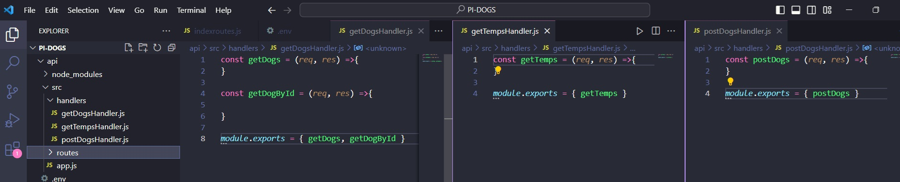

# **PROCESO DE CREACION PI - BACKEND.**<br />
NOTA:<br />
cada vez que haya un emoji de 🔴 es parte de una instrucción.<br />
cada vez que haya un emoji de 🟡 es parte de una anotacion.<br />


```bash
```
---
<br />
<br />
Inicialzo (backend)<br />
🔴Creamos carpeta api <br />
<br />

```bash
npm init -y
npm i express axios nodemon morgan cors sequelize pg pg-hstore dotenv
```
<br />

---
<br />
🔴en el archivo package.json, añadimos en scripts<br />
🟡 (esto va a poner a nodemon a escuchar el archivo index.js)<br />
<br />
<br />

```bash
"start": "nodemon index.js"
```

<br />

---
<br />

🔴crear archivo index en api.<br />

---
<br />
<br />
🔴crear carpeta src<br />
🔴dentro creamos el archivo app.js    <br />
🔴requerimos a express<br />
<br />
<br />

```bash
const express = require("express");
const app__server = express();
module.exports = app__server;
```

<br />
<br />

---
<br />
🔴En la carpeta api, dentro del archivo index.js<br />
🔴ponemos a escuchar el servidor en algun puerto.<br />
🔴requerimos app.<br />
🔴creamos const con el puerto.<br />
<br />
<br />

```bash
const server = require("./src/app");
const PORT = 3001;

server.listen(PORT, () =>{
   console.log(`Server iniciado en el puerto ${PORT}`)
})
```
<br />
<br />

---

<br />
🔴dentro de la carpeta src, en el archivo app.js<br />
🔴requerimos a morgan y cors, 2 middleware.<br />
🔴Usando el metodo .use invocamos a express.json() para convertir lo qe nos llegue por express en json.<br />
🔴invocamos a morgan ejecutado y le pasamos el parametro de "dev" para que se ejecute solo en el ambito de desarrollo.<br />
🔴invocamos a cors ejecutado.<br />
🔴y colocamos una función de middleware con Controles de acceso;<br />

<br />
🟡 un middleware es una intermediario/una funcion que se ejecuta antes de la resolución de la request.<br />
O puede ser cualquier funcion que pongamos como intermediario en nuestra aplicacion con un req, res y next como parametros<br /><br /><br />
🆎EJEMPLO:<br /><br />

<br /><br />

<br />
<br />
<br />
🟡 el metodo use() nos permite decirle a la aplicacion que ocupe algun middleware.<br />

🟡 MORGAN es un middleware.<br />
<br />
<br />

```bash
const morgan = require("morgan");
const cors = require("cors")

app__server.use(express.json())
app__server.use(morgan("dev"));
app__server.use(cors())

app__server.use((req, res, next) => {
    res.header('Access-Control-Allow-Origin', '*');
    res.header('Access-Control-Allow-Credentials', 'true');
    res.header(
       'Access-Control-Allow-Headers',
       'Origin, X-Requested-With, Content-Type, Accept'
    );
    res.header(
       'Access-Control-Allow-Methods',
       'GET, POST, OPTIONS, PUT, DELETE'
    ); 
    next();
 });
```

---
<br />
🔴Crear una carpeta routes en la carpeta src y dentro crear un archivo indexroutes.js que contendra las rutas con los "handlers".<br />
🔴Crear una constante router, requerir express, usar el metodo Router de express y ejecutarlo.<br />
<br />
🟡 La funcion .Router de express, nos permite manejar las rutas con sus respectivos handlers, para crear manejadores de rutas montables y modulares.<br />
<br />
<br />

```bash
const express = require("express");
const router = express.Router();
```
<br />
<br />
🔴 En src crear una carpeta de "handlers" esta contendra los archivos con las funciones de nuestras rutas.<br />
🔴Crear las funciones de cada ruta y exportarlas.<br />
<br />

<br />
<br />

🔴Importarlas en indexroutes.js<br /> 
🔴En indexroutes.js crear las rutas, con los metodos https get post etc y pasarle como parametro (el string de la url, funcion)<br />
🔴Exportar la funcion Router.<br />
<br />

```bash
const { getDogs, getDogsByRazaId } = require("../handlers/getDogsHandler")
const { getTemps } = require("../handlers/getTempsHandler")
const { postDogs } = require("../handlers/postDogsHandler")

router.get("/dogs", getDogs);
router.get("/dogs/:idRaza", getDogsByRazaId);
router.get("/temperaments", getTemps);
router.post("/dogs", postDogs);

module.exports = { router }
```

---
<br />
🔴 En app.js requerir router desde el indexroutes.js este contendra las rutas que le pasaremos a nuestro end-point<br />
<br />

```bash
const { router } = require("./routes/indexroutes")

app__server.use(router)
```

🟡 
El handlers nunca interactua con fuentes externas, se va a encargar de recibir la request, de unificar los datos recibidos y devolver una respuesta. <br />
El controller es otra funcion, que es la que interactua con las fuentes externas.<br />


