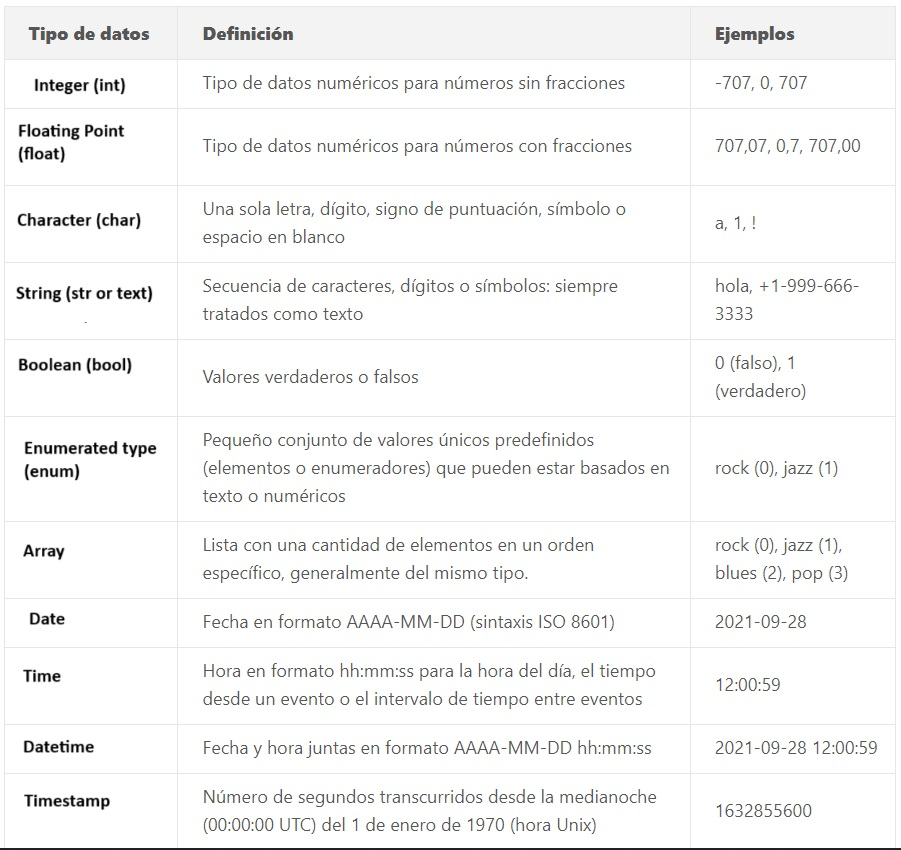

# **PROCESO DE CREACION DB**
NOTA:<br />
cada vez que haya un emoji de 🔴 es parte de una instrucción.<br />
cada vez que haya un emoji de 🟡 es parte de una anotacion.<br />
cada vez que haya un emoji de 🆎 es un ejemplo.<br />


---
<br />
🔴Crear desde SQL Shell o desde PGAdmin una base de datos, la que usaremos para conectar nuestro modulo de back-end.<br />
🔴En nuestra carpeta de API, en nuestro archivo .env donde tenemos nuestra variables de etorno, configurar el usuario y password y host.<br />

<br />


---
<br />
🔴Dentro de nuestra carpeta "src" debemos crear una carpeta que contendra los modelos de nuestra base de datos, "models".<br />
🔴Dentro de la carpeta "models" crearemos los archivos dogs  y temperaments, donde crearemos y definiremos nuestros models.<br />
<br />
🔴Consultamos a nuestra a API nuestro objecto a importar y debemos definirlo con sus atributos y el tipo de dato que corresponda.<br />
🔴Requerimos el metodo DataTypes, que nos va a permitir definir el valor de nuestro tipo de dato.<br />
🔴En el siguiente paso deberiamos crear nuestra funcion, que definira nuestro modelo, para esto usamos,<br />
🔴Usamos el metodo .define("",  {  }  ) donde en primer parametro como string le pasamos el nombre del modelos y como<br />
segundo parametro le pasamos el objeto con sus elementos y atributos.<br />
🔴Por ultimo exportarla para generar la conexion.<br />


🆎En este caso lo que hacemos es directamente exportar la funcion y al mismo tiempo definirla.<br />
```bash
module.exports = (sequelize) => {

  // defino el modelo
  sequelize.define('dog', {} )

};
```


🟡type: DataTypes.continuado del tipo de dato = nos sirve para indicar el tipo de dato que se le asigna.<br />
<br /><br />

<br />
🟡 UUID = tambien es un tipo de dato. Los UUID son cadenas largas de 128 bits que pueden garantizar la singularidad en el espacio y el <br />tiempo. Son ampliamente utilizados para identificar recursos de forma única y de manera global. Hay varias versiones de UUID, <br />cada una con un formato ligeramente diferente.<br />

### **Restrincciones** 

🟡primaryKey = Para identificar de manera unica cada registro. No sirve como un id, donde no se puede repetir.<br />
🟡unique = para que no se inserten valores duplicados en una columna específica o combinación de columnas que participen en la<br />restricción UNIQUE y no formen parte de la CLAVE PRIMARIA.<br />
🟡allowNull  = nos sirve para indicarle al usuario que este campo no debe estar vacio.<br />
🟡defaultValue = nos sirve para indicarle el valor que nos trae por defecto este atributo.<br />
🟡timestamps = nos sirve para saber la fecha y horario en que ejecutamos la peticion.<br />
<br />

---
<br />
🔴Una vez creados nuestros modelos, crear en nuestra carpeta src un archivo para nuestra base de datos " db.js ".<br />

🔴En este archivo requerir las variables de entorno y usar el metodo config.<br />
🟡.config() contiene información que controla la carga de módulos, configuraciones de seguridad, configuraciones del estado de la sesión,<br /> opciones de compilación y el lenguaje de la aplicación.<br />

🔴Crear una const con un destructuring de nuestra info y leerlo con process.env.<br />
🔴Requerimos a sequelize desde sequelize por ultimo la instanciamos con PG.<br />
🔴En el metodo Sequelize le pasaremos la url, con nuestro respectivos datos y como segundo parametro.<br />
🔴Le pasamos un objeto de clave/valor, logging y native iniciados en false.<br />
🟡Podemos ver las configuraciones desde la documentacion de PostGress.<br />

```bash
require('dotenv').config(); 
const {DB_USER, DB_PASSWORD, DB_HOST} = process.env;
const { Sequelize } = require('sequelize');
const sequelize = new Sequelize(`postgres://${DB_USER}:${DB_PASSWORD}@${DB_HOST}/dogs`, 
{
  logging: false, // set to console.log to see the raw SQL queries
  native: false, // lets Sequelize know we can use pg-native for ~30% more speed
});

```
🔴En consola instalamos el (modulo/pipe) path y fs.<br />
🟡Un modulo o pipe son un conjunto de funciones/metodos que nos van a facilitar codigo.

```bash
npm i path fs
```
🔴Una vez instalados los requerimos desde su respectivos modulos.<br />
```bash
const fs = require('fs');
const path = require('path');
```
🔴Ahora vamos a crear un modulo donde hagamos un recorrido de todos nuestros models para inyectarles la conexión sequelize<br />
<br />
🔴Utilizaremos el metodo basename y le pasamos por parametro "__filename"<br />
🟡El metodo basename nos devuelve la parte final de la ruta, del archivo que le pasemos.<br />
🟡 __filename nos va a devolver por defecto la ruta del archivo en donde estamos parados.<br />
🟡 __dirname nos va a devolver por defecto la ruta de la carpeta en donde estamos parados.<br />
🟡 documentacion de metodo path https://www.youtube.com/watch?v=p995SdRXw_E <br />
<br />
🔴Crearemos un array donde vamos a pushear nuestras rutas modelsDefiners.<br />
🔴Usaremos el metodo readdirSync del modulo fs con el cual vamos a LEER las rutas, este recibe por parametro al metodo de path, llamado join y le pasaremos por parametro "__dirname", "/models".<br />
🟡Con el metodo readdirSync del modulo fs, vamos a leer las rutas<br />
🟡El metodo join, recibe por parametro unicamente strings que luego los une y los devuelve.<br />
🔴Filtraremos los archivos ".js" y los vamos a pushear a nuestros array ya requeridos, para despues iterar con de cada uno e inyectarles la conexion con sequelize.<br />
<br />

```bash
const basename = path.basename(__filename);

const modelDefiners = [];

// Leemos todos los archivos de la carpeta Models
fs.readdirSync(path.join(__dirname, '/models'))
  .filter((file) => (file.indexOf('.') !== 0) && (file !== basename) && (file.slice(-3) === '.js'))

// otra opcion para leer los archivos de la carpeta Models
// .filter((file) => (file = file.path.extname && file === ".js" ))

// los requerimos y agregamos al arreglo modelDefiners
  .forEach((file) => {
    modelDefiners.push(require(path.join(__dirname, '/models', file)));
  });


// Injectamos la conexion (sequelize) a todos los modelos
modelDefiners.forEach(model => model(sequelize));

```
<br />
🔴Una vez que generemos la conexion, vamos a capitalizar los nombres de nuestros models.<br />
🔴Vamos a convertirlos en un objeto de tipo iterador (para poder iterar con cada uno de los elementos) y después lo pasaremos a un objeto que contenga atributos de clave:valor, para finalmente hacer un destruccturing y poder relacionarlos.<br />
<br />

```bash
// Capitalizamos los nombres de los modelos ie: product => Product
let entries = Object.entries(sequelize.models);
let capsEntries = entries.map((entry) => [entry[0][0].toUpperCase() + entry[0].slice(1), entry[1]]);
sequelize.models = Object.fromEntries(capsEntries);

// En sequelize.models están todos los modelos importados como propiedades
// Para relacionarlos hacemos un destructuring
const { Temperaments, Dogs } = sequelize.models;

// Aca vendrian las relaciones
// Product.hasMany(Reviews);
Dogs.belongsToMany(Temperaments, {through:"dogs_temperament"})
Temperaments.belongsToMany(Dogs, {through:"dogs_temperament"})

```
<br />
🔴Por ultimo exportamos el modulo, haciendo un destruccturing, y trayendo una copia de todo lo que tengamos en sequelize.models y agregandole propiedades para despues importalas mas facil.<br />


```bash
module.exports = {
  ...sequelize.models, // para poder importar los modelos destructurados, ejemplos: const { Product, User } = require('./db.js');
  conn: sequelize,     // para importart la conexión { conn } = require('./db.js');
};

```
🟡 ...sequelize.models, esto no vas a traer todos los elementos que tengamos dentro de sequelize.models y nos va a permitir poder<br /> modificar las propiedades de los elementos que querramos reemplazar<br />
🟡 una vez que tengamos que hagamos el distruccturing { } con los objetos vamos a poder importarlas de la siguiente manera<br />
// para importart la conexión { conn } = require('./db.js');<br />
<br />

---
<br />
🔴Ahora nos dirigimos a nuestro archivo index, donde importaremos nuestra conexion de la base de datos.<br /><br />
🔴Usaremos el metodo sync y le pasaremos como parametro un objeto con la propiedad force:true.<br />
🟡conn.sync({ force: true }).then esto es para sincronizar todos los models a la vez y cada vez que levantemos nuestra base de datos se reinicie.<br />
<br />

```bash

const { conn } = require('./src/db.js');

conn.sync({ force: true }).then(() => {

server.listen( PORT, () =>{ console.log(`Server iniciado en el puerto ${PORT}`)} )

});

```

🟡En el momento que terminos pasaremos a false, para guardar algun perro que hayamos creado o subido a la plataforma. para que en la base de datos se vea.<br />
🟡Nos sirve para hacer pruebas y en caso de que se caiga la base, lo vamos a tener guardado.<br />
<br />

